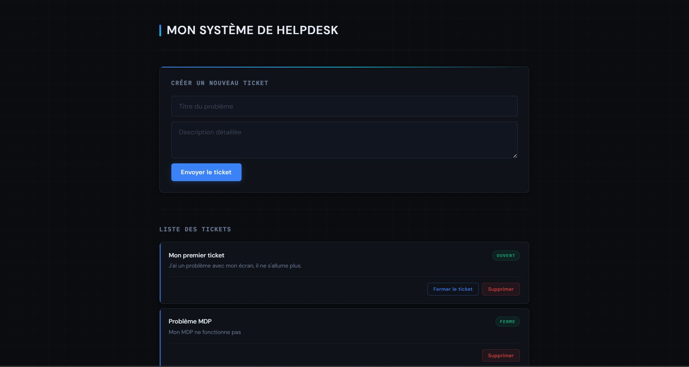

# 🎫 Helpdesk System - Backend (API REST)

API robuste développée avec **Spring Boot** pour la gestion de tickets de support technique. Ce projet implémente une architecture propre et sécurisée pour un CRUD complet.

## 🚀 Présentation Visuelle
Voici un aperçu de l'interface utilisateur alimentée par cette API :


*(L'interface Frontend Vue.js utilisant cette API)*

## 🤖 Méthodologie "AI-Pair Programming"
Ce projet a été conçu et débuggé en collaboration avec une **IA (Gemini)**. Cette approche m'a permis de :
- Mettre en place rapidement une architecture **MVC** propre.
- Implémenter des **Best Practices** (DTO pour la mise à jour de statut, ResponseEntity pour les codes HTTP).
- Résoudre efficacement les problématiques d'intégration (Configuration fine du **CORS**).

## 🛠️ Stack Technique
- **Java 17** / **Spring Boot 3**
- **Spring Data JPA** (Persistance)
- **MySQL** (Base de données)
- **Maven** (Gestionnaire de dépendances)

## 📡 Endpoints API Principaux
Toutes les requêtes doivent inclure le header `Content-Type: application/json`.

| Méthode | Endpoint | Description | Body (Exemple) |
| :--- | :--- | :--- | :--- |
| `GET` | `/api/tickets` | Récupérer tous les tickets (triés par le Front). | - |
| `POST` | `/api/tickets` | Créer un nouveau ticket (statut 'OUVERT' par défaut). | `{ "title": "...", "description": "..." }` |
| `PUT` | `/api/tickets/{id}/status` | Mettre à jour le statut d'un ticket. | `{ "status": "FERME" }` |
| `DELETE` | `/api/tickets/{id}` | Supprimer définitivement un ticket. | - |

## ⚙️ Installation & Lancement
1.  Créer une base de données MySQL nommée `helpdesk`.
2.  Configurer vos identifiants dans `src/main/resources/application.properties`.
3.  Lancer l'application :
    ```bash
    ./mvnw spring-boot:run
    ```
    *(L'API sera accessible sur `http://localhost:8080`)*